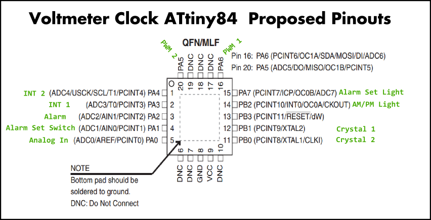

#Microcontroller Selection and Justification by Someone Who's Only Selected One or Two Before

>**Executive Summary:** An ATtiny84 microchip was selected based on requirements developed after prototyping a Voltmeter clock with a Digispark Board/ATtiny85. Specifically, the ATtiny84 can handle the 10 I/O plus ISP lines and a 5Kb+ program size.

##Intro
The purpose of this document is to justify the selection of a microcontroller for the Voltmeter Clock. Although a prototype was built using a Digispark Board/ATtiny85, the ATtiny85 didn't have enough I/O to implement all the desired features.

##Requirements review:
The following quotes from the [requirements doc](requirements.md).  
>**Pin summary**  
>1 analog in to read selector switch / voltage divider  
>2 interrupts to read quadrature encoder  
>2 PWM outputs  
>3 digital outputs for am/pm light, alarm set, and buzzer  
>2 pins for external oscillator crystal  

All together, this works out to 8 I/O pins, the 2 clock pins, and whatever is needed for In System Programming (ISP) pins, which can serve double duty.

##Design Descision \#1: Stay in the Atmel family
This decision is made more on qualitative measures rather than rigorous analysis. I'm familiar with the Arduino toolchain, I have some familiarity with libraries available for the ATtiny, and the parts are in stock and available in volumes of hundreds through Digikey.

##Design Decision \#2: Chip Selection with parametric tool
Atmel has a parametric selection tool [here](http://www.atmel.com/products/microcontrollers/avr/default.aspx?tab=parameters). Using the I/O pin slider on the parametric tool, the closest breakpoint after the 10 I/O pins (plus ISP) I required is 11. Setting the maximum number of I/O pins at 12 and making sure I have enough flash (8Kb is the next breakpoint after the estimated 5Kb in size), results in a more manageable selection choice of 4 devices: the ATtiny84, plus three other automotive qualified and/or low power variants.  Of these, I've selected the **ATtiny84**

##Design Note on the Dual Purpose ISP pins and RESET
I learned that Digispark disabled the RESET pin on the ATtiny85 after burning the initial bootloader with the ISP. This means that once the bootloader is on there and the RESET pin has been switched to a general purpose input, it can't be programmed with ISP any more. **I would like to be able to reprogram the boards!**

Quoting from the digispark [website](https://digistump.com/wiki/digispark/tutorials/programming)
>\[ISP\] is meant to provide a cheap way to update code, to fix bugs, or to extend capabilities without unsoldering the chip. There are, however,some restrictions to this mode as well: ISP uses MISO, MOSI and SCK (as well as RESET), and there is limited interference with those three pins allowed. Atmel recommends using resistors between these ISP pins and their other uses in a circuit. In general it's a good recommendation, to read design considerations:

>As ISP connection needs the enabled RESET function (and therefore disabled GPIO function of the shared physical pin), there is no way, to program an off-the-shelf digispark with any ISP device, because the digispark has disabled the reset function.

##Pin out check on the ATtiny84
The proposed pinouts are below. Note that there were enough pins to be able to leave the reset pin clear.

8kB memory [check!]  
Interrupts galore [check!]  
2 PWM channels [check!]  
Digital channels galore [check!]  
External clock pins [check!]  

##Conclusion
The **ATtiny84** is an appropriate chip for this project.
